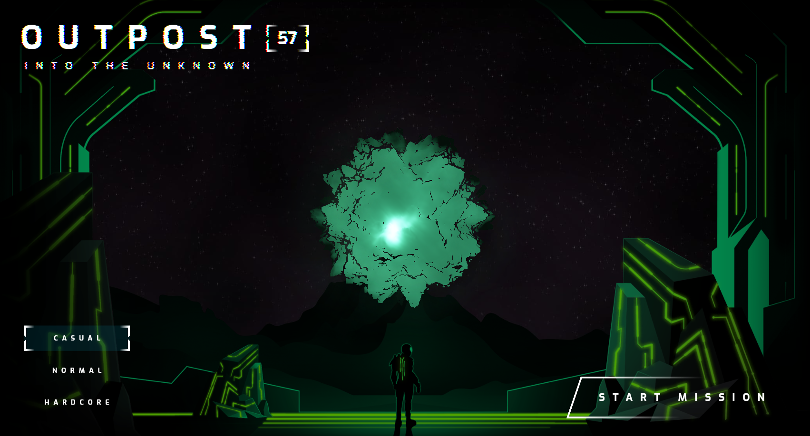
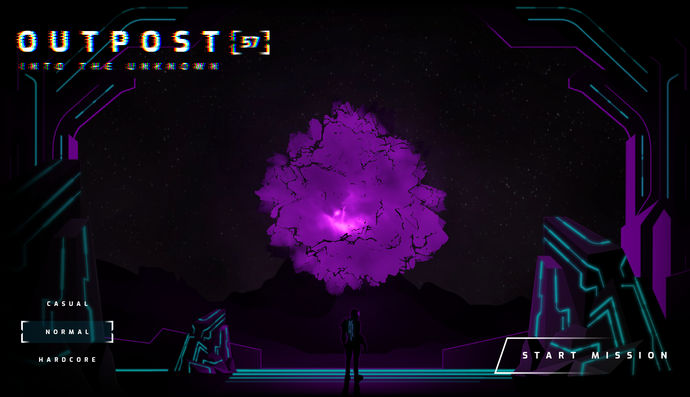
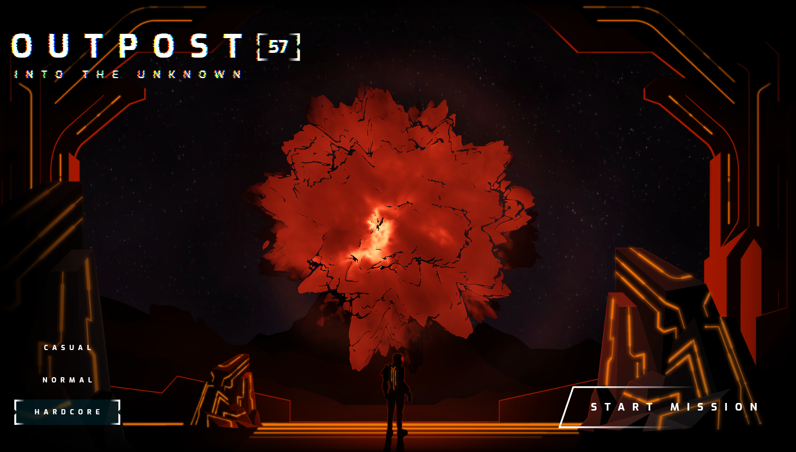

# O U T P O S T

This project is based on the [Codelab Next Gen UI](https://codelabs.developers.google.com/codelabs/flutter-next-gen-uis) from Google I/O 2023.

It's a single webpage and for the <b>Web</b>

You can also check the [Website](https://outpost-host.web.app/) hosted on <b>Firebase Hosting</b>

## 💻Screens 
  

   </img>
   
   
    </img>
   
   
    </img>
  

  
  ---
Made with ♥ by Mariugo 🚀

